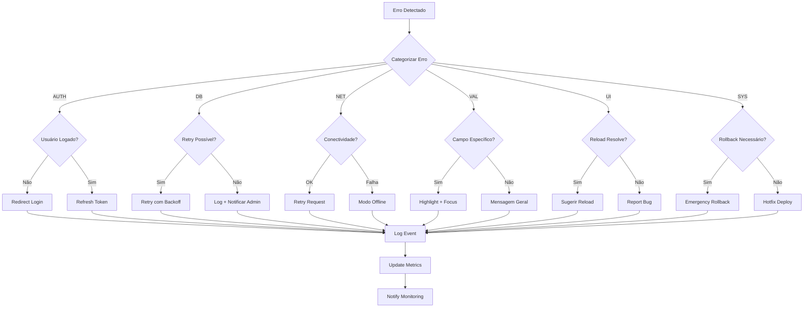

# 🚨 Matriz de Erros - Sistema de Tarefas

**Sistema:** Dashboard de Estudos - Módulo de Tarefas  
**Versão:** 1.0  
**Data:** 29 de Agosto de 2025  
**Ambiente:** Produção (https://v0-new-conversation-steel-three.vercel.app)

---

## 📊 CLASSIFICAÇÃO DE ERROS

### Códigos de Severidade
- 🔴 **CRÍTICO**: Sistema inoperante
- 🟡 **MODERADO**: Funcionalidade degradada  
- 🟢 **BAIXO**: Experiência comprometida
- 🔵 **INFO**: Eventos informativos

### Códigos de Categoria
- **AUTH**: Autenticação e autorização
- **DB**: Operações de banco de dados
- **NET**: Conectividade e rede
- **VAL**: Validação de dados
- **UI**: Interface do usuário
- **SYS**: Sistema e infraestrutura

---

## 🎯 MATRIZ PRINCIPAL DE ERROS

| Código | Categoria | Severidade | Descrição | Cenário | Causa Provável | Ação Imediata | Log Level |
|--------|-----------|------------|-----------|---------|----------------|---------------|-----------|
| **AUTH-001** | AUTH | 🔴 | Usuário não autenticado | Acesso à /tasks sem login | Token ausente/inválido | Redirect para login | INFO |
| **AUTH-002** | AUTH | 🔴 | Token JWT expirado | Ações durante sessão expirada | Expiração natural do token | Auto-refresh token | WARNING |
| **AUTH-003** | AUTH | 🔴 | RLS violation | Tentativa de acessar dados de outro usuário | Manipulação maliciosa | Log security event | CRITICAL |
| **DB-001** | DB | 🔴 | Falha na inserção de tarefa | Erro ao salvar nova tarefa | Constraint violation, conectividade | Retry + feedback | ERROR |
| **DB-002** | DB | 🟡 | Timeout na consulta | Carregamento lento de tarefas | Alta latência do banco | Cache + retry | WARNING |
| **DB-003** | DB | 🟡 | Constraint violation | Dados inválidos inseridos | Validação frontend falhou | Highlight campos | WARNING |
| **NET-001** | NET | 🔴 | Supabase indisponível | Aplicação não conecta | Outage do provedor | Health check + fallback | CRITICAL |
| **NET-002** | NET | 🟡 | Conectividade intermitente | Requests falhando esporadicamente | Problema de rede do usuário | Retry automático | WARNING |
| **VAL-001** | VAL | 🟢 | Título vazio | Envio de formulário incompleto | Validação não funcionou | Highlight campo obrigatório | INFO |
| **VAL-002** | VAL | 🟢 | Data inválida | Data no passado | Usuário inseriu data incorreta | Picker de data | INFO |
| **VAL-003** | VAL | 🟢 | Tempo estimado inválido | Valor fora do range permitido | Input manual incorreto | Reset para valor padrão | INFO |
| **UI-001** | UI | 🟢 | Event listener não funcionou | Botão não responde | JavaScript error | Reload page | DEBUG |
| **UI-002** | UI | 🟢 | Form não reseta | Estado persistente após envio | State management issue | Force reset | DEBUG |
| **SYS-001** | SYS | 🔴 | Build/Deploy error | Sistema não acessível | Erro no pipeline CI/CD | Rollback version | CRITICAL |

---

## 🔄 FLUXOGRAMA DE TRATAMENTO



---

## 🎨 TEMPLATES DE MENSAGENS DE ERRO

### Para Usuários Finais

#### ✅ Sucesso
```typescript
export const successMessages = {
  TASK_CREATED: {
    title: "✅ Tarefa Criada!",
    message: "Sua tarefa foi adicionada com sucesso.",
    duration: 3000
  },
  TASK_UPDATED: {
    title: "📝 Tarefa Atualizada",
    message: "As alterações foram salvas.",
    duration: 3000
  }
}
```

#### 🔐 Autenticação
```typescript
export const authMessages = {
  AUTH_REQUIRED: {
    title: "🔐 Login Necessário",
    message: "Para criar tarefas, você precisa estar autenticado.",
    action: {
      label: "Fazer Login",
      href: "/auth/login"
    },
    variant: "default"
  },
  SESSION_EXPIRED: {
    title: "⏰ Sessão Expirada", 
    message: "Sua sessão expirou. Redirecionando para o login...",
    action: {
      label: "Login Agora",
      href: "/auth/login"
    },
    variant: "warning"
  }
}
```

#### 🌐 Conectividade
```typescript
export const networkMessages = {
  OFFLINE: {
    title: "🌐 Você está Offline",
    message: "Verifique sua conexão com a internet.",
    action: {
      label: "Tentar Novamente",
      onClick: () => window.location.reload()
    },
    variant: "destructive"
  },
  SLOW_CONNECTION: {
    title: "🐌 Conexão Lenta",
    message: "A operação pode demorar mais que o normal.",
    variant: "warning"
  }
}
```

#### ❌ Erros de Validação  
```typescript
export const validationMessages = {
  REQUIRED_FIELD: {
    title: "❌ Campo Obrigatório",
    message: "Por favor, preencha este campo.",
    variant: "destructive"
  },
  INVALID_DATE: {
    title: "📅 Data Inválida",
    message: "A data deve ser hoje ou no futuro.",
    variant: "destructive" 
  },
  TITLE_TOO_LONG: {
    title: "✂️ Título Muito Longo",
    message: "O título deve ter no máximo 200 caracteres.",
    variant: "destructive"
  }
}
```

#### 🚨 Erros Críticos
```typescript
export const criticalMessages = {
  SYSTEM_ERROR: {
    title: "😞 Algo Deu Errado",
    message: "Ocorreu um erro inesperado. Nossa equipe foi notificada.",
    action: {
      label: "Reportar Problema",
      onClick: () => reportError()
    },
    variant: "destructive"
  },
  MAINTENANCE_MODE: {
    title: "🔧 Sistema em Manutenção",
    message: "Voltaremos em breve. Obrigado pela paciência!",
    variant: "warning"
  }
}
```

### Para Desenvolvedores (Console/Logs)

```typescript
export const developerMessages = {
  AUTH_001: "[AUTH-001] Usuário não autenticado tentando acessar /tasks",
  AUTH_002: "[AUTH-002] Token JWT expirou durante operação",
  DB_001: "[DB-001] Falha na inserção: constraint violation em 'titulo'",
  NET_001: "[NET-001] Supabase unreachable - checking fallback",
  VAL_001: "[VAL-001] Validação frontend falhou: título vazio submetido"
}
```

---

## 🔧 IMPLEMENTAÇÃO DO SISTEMA DE ERROS

### 1. Hook Personalizado de Tratamento

```typescript
// hooks/useErrorHandler.ts
import { useCallback } from 'react'
import { useToast } from '@/components/ui/use-toast'
import { errorMappings } from '@/lib/error-mappings'

export function useErrorHandler() {
  const { toast } = useToast()
  
  const handleError = useCallback((error: Error | string, context?: string) => {
    const errorCode = mapErrorToCode(error)
    const errorConfig = errorMappings[errorCode] || errorMappings.UNKNOWN_ERROR
    
    // Log para desenvolvedores
    console.error(`[${errorCode}] ${context || 'Unknown context'}:`, error)
    
    // Notificação para usuário
    toast({
      variant: errorConfig.variant,
      title: errorConfig.title,
      description: errorConfig.message,
      action: errorConfig.action && (
        <Button 
          variant="outline" 
          onClick={errorConfig.action.onClick}
        >
          {errorConfig.action.label}
        </Button>
      )
    })
    
    // Métricas
    trackError(errorCode, context)
  }, [toast])
  
  return { handleError }
}
```

### 2. Mapeamento Inteligente de Erros

```typescript
// lib/error-mappings.ts
import { PostgrestError } from '@supabase/supabase-js'

export function mapErrorToCode(error: Error | PostgrestError | string): string {
  if (typeof error === 'string') {
    return 'GENERIC_ERROR'
  }
  
  // Supabase/PostgreSQL errors
  if ('code' in error) {
    switch (error.code) {
      case 'PGRST116': return 'AUTH_001' // RLS violation
      case '23505': return 'DB_003' // Unique constraint
      case '23514': return 'VAL_003' // Check constraint  
      case 'PGRST301': return 'AUTH_002' // JWT expired
      default: return 'DB_001'
    }
  }
  
  // JavaScript/Network errors
  if (error.name === 'TypeError' && error.message.includes('fetch')) {
    return 'NET_001'
  }
  
  if (error.message.includes('authentication')) {
    return 'AUTH_001'
  }
  
  return 'SYS_001'
}
```

### 3. Interceptor de Requests

```typescript
// lib/supabase-client.ts
import { createClient } from '@supabase/supabase-js'

const supabaseClient = createClient(url, key)

// Interceptar erros de forma global
const originalFrom = supabaseClient.from
supabaseClient.from = function(table: string) {
  const query = originalFrom.call(this, table)
  
  // Intercept insert/update/delete
  const originalInsert = query.insert
  query.insert = function(values: any) {
    return originalInsert.call(this, values).then(result => {
      if (result.error) {
        console.error(`[DB] Insert failed on ${table}:`, result.error)
      }
      return result
    })
  }
  
  return query
}

export { supabaseClient as supabase }
```

---

## 📈 MÉTRICAS E MONITORAMENTO

### KPIs de Erro

```typescript
export const errorMetrics = {
  // Taxa de erro por categoria
  error_rate_by_category: {
    auth: 0, // Calculado: erros_auth / total_requests
    db: 0,
    network: 0,
    validation: 0,
    ui: 0,
    system: 0
  },
  
  // Top 5 erros mais frequentes
  top_errors: [
    { code: 'AUTH_001', count: 245, percentage: 45.2 },
    { code: 'VAL_001', count: 123, percentage: 22.7 },
    { code: 'NET_002', count: 89, percentage: 16.4 }
  ],
  
  // Recovery rate (quantos erros foram resolvidos automaticamente)
  recovery_rate: 0.78, // 78% dos erros são auto-resolvidos
  
  // Mean Time To Recovery (MTTR)
  mttr_seconds: 15.3 // 15.3s em média para resolver
}
```

### Dashboard de Monitoramento

```typescript
// components/admin/ErrorDashboard.tsx
export function ErrorDashboard() {
  const { data: errorStats } = useQuery('error-stats', getErrorStats)
  
  return (
    <div className="grid grid-cols-1 md:grid-cols-3 gap-6">
      {/* Taxa de Erro Geral */}
      <Card>
        <CardHeader>
          <CardTitle>Taxa de Erro</CardTitle>
        </CardHeader>
        <CardContent>
          <div className="text-2xl font-bold">
            {(errorStats?.error_rate * 100).toFixed(2)}%
          </div>
          <Progress value={errorStats?.error_rate * 100} />
        </CardContent>
      </Card>
      
      {/* Top Erros */}
      <Card>
        <CardHeader>
          <CardTitle>Erros Mais Frequentes</CardTitle>
        </CardHeader>
        <CardContent>
          {errorStats?.top_errors.map(error => (
            <div key={error.code} className="flex justify-between">
              <span>{error.code}</span>
              <Badge variant={error.count > 100 ? 'destructive' : 'secondary'}>
                {error.count}
              </Badge>
            </div>
          ))}
        </CardContent>
      </Card>
      
      {/* Recovery Rate */}
      <Card>
        <CardHeader>
          <CardTitle>Taxa de Recuperação</CardTitle>
        </CardHeader>
        <CardContent>
          <div className="text-2xl font-bold">
            {(errorStats?.recovery_rate * 100).toFixed(1)}%
          </div>
          <p className="text-sm text-muted-foreground">
            MTTR: {errorStats?.mttr_seconds}s
          </p>
        </CardContent>
      </Card>
    </div>
  )
}
```

---

## 🚨 ALERTAS E NOTIFICAÇÕES

### Critérios de Alerta

| Condição | Severidade | Canal | Ação |
|----------|------------|-------|------|
| Taxa de erro > 5% | 🔴 CRÍTICO | Slack + SMS | Investigação imediata |
| Erros AUTH > 50/min | 🟡 MODERADO | Slack | Verificar sistema auth |
| Supabase down | 🔴 CRÍTICO | Todos os canais | Ativar fallback |
| MTTR > 60s | 🟡 MODERADO | Email | Review processo |

### Webhook para Alertas

```typescript
// api/alerts/error-webhook.ts
export async function POST(request: Request) {
  const { error_code, count, threshold } = await request.json()
  
  if (count > threshold) {
    await notifySlack({
      channel: '#alerts',
      message: `🚨 Erro ${error_code} excedeu limite: ${count}/${threshold}`,
      color: 'danger'
    })
    
    if (CRITICAL_ERRORS.includes(error_code)) {
      await notifySMS({
        to: ONCALL_NUMBERS,
        message: `CRITICAL: ${error_code} - ${count} ocorrências`
      })
    }
  }
  
  return new Response('OK')
}
```

---

## 📋 RUNBOOK DE EMERGÊNCIA

### Cenário 1: Sistema Completamente Indisponível
```bash
# 1. Verificar status dos serviços
curl -I https://v0-new-conversation-steel-three.vercel.app/
curl -I https://your-supabase-url.supabase.co/

# 2. Rollback imediato
vercel --prod --confirm rollback

# 3. Notificar usuários
# Ativar página de manutenção

# 4. Investigar logs
vercel logs --follow

# 5. Hotfix se necessário
git checkout main
git revert <problematic-commit>
git push origin main
```

### Cenário 2: Autenticação Falhando em Massa
```bash
# 1. Verificar status Supabase Auth
curl -X GET "https://your-project.supabase.co/auth/v1/health"

# 2. Verificar configurações
echo $NEXT_PUBLIC_SUPABASE_URL
echo $NEXT_PUBLIC_SUPABASE_ANON_KEY

# 3. Fallback para modo read-only
# Ativar flag MAINTENANCE_MODE=true

# 4. Comunicar ETA de resolução
```

### Cenário 3: Database Sobrecarregado
```bash
# 1. Ativar cache agressivo
# 2. Reduzir frequency de polling
# 3. Implementar rate limiting temporário
# 4. Escalar recursos se disponível
```

---

## 🏁 CHECKLIST DE IMPLEMENTAÇÃO

### Fase 1: Básico ✅
- [ ] Implementar useErrorHandler hook
- [ ] Criar mapeamentos de erro
- [ ] Adicionar toast notifications
- [ ] Configurar logging estruturado

### Fase 2: Avançado ⚠️
- [ ] Dashboard de monitoramento
- [ ] Alertas automáticos  
- [ ] Métricas de recuperação
- [ ] Runbooks automatizados

### Fase 3: Otimização 🔄
- [ ] Machine learning para predição
- [ ] Auto-healing capabilities
- [ ] Performance optimization
- [ ] User experience improvements

---

**Matriz atualizada em: 29 de Agosto de 2025**  
**Próxima revisão: 5 de Setembro de 2025**  
**Responsável:** Equipe de Desenvolvimento