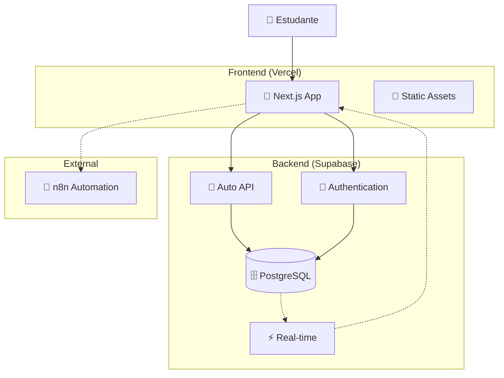
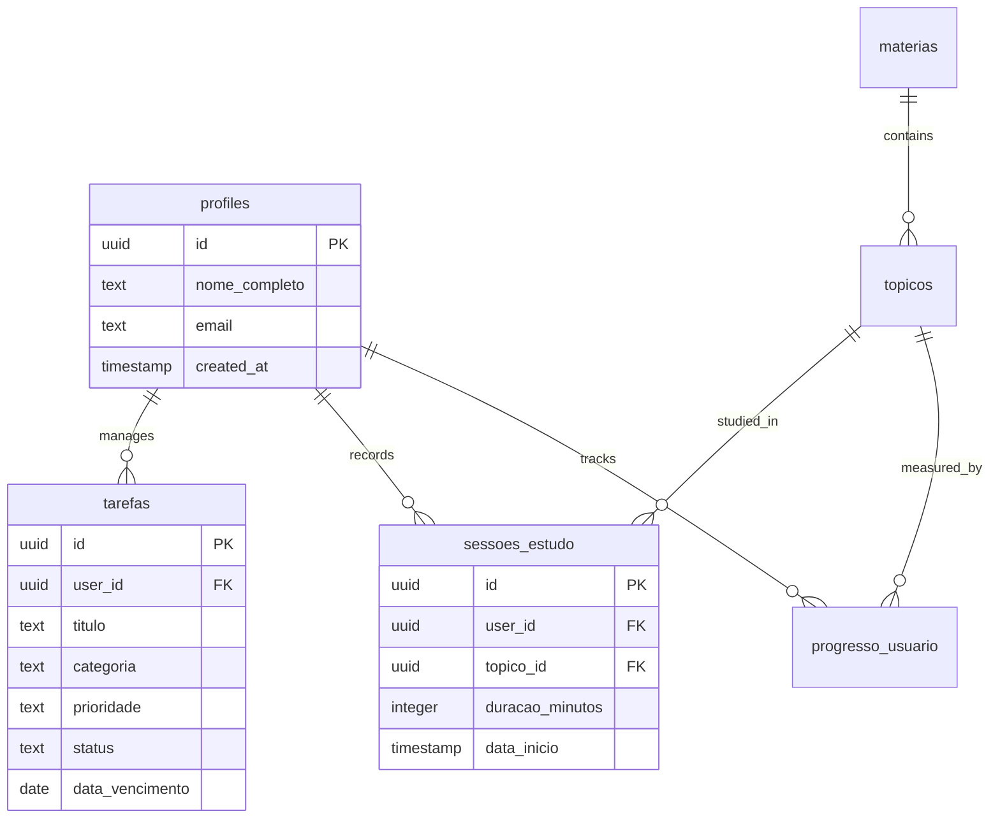
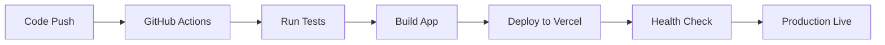

# Documentação do Dashboard de Estudos

Documentação completa da arquitetura e implementação do sistema de dashboard de estudos para concursos públicos.

## 📋 Índice

### 🏗️ [Documentação de Arquitetura](./architecture/)

1. **[Visão Geral da Arquitetura](./architecture/README.md)**
   - Modelo C4 (Contexto, Containers, Componentes)
   - Diagramas do sistema
   - Decisões arquiteturais principais
   - Schema do banco de dados

2. **[Fluxos de Dados](./architecture/data-flow-diagrams.md)**
   - Fluxo de autenticação
   - Gerenciamento de tarefas
   - Sessões de estudo
   - Progress tracking
   - Analytics e métricas

3. **[Schema do Banco](./architecture/database-schema.md)**
   - Estrutura completa do PostgreSQL
   - Relacionamentos entre entidades
   - Políticas de segurança (RLS)
   - Índices e performance

4. **[Decisões Arquiteturais](./architecture/architectural-decision-records.md)**
   - ADRs completos com contexto e justificativas
   - Comparação de alternativas consideradas
   - Consequências de cada decisão

## 🎯 Resumo Executivo

O **Dashboard de Estudos** é uma aplicação web moderna desenvolvida para auxiliar estudantes na preparação para concursos públicos, especificamente para o concurso da ASOF (Analista de Sistemas e Finanças).

### Características Principais

- ✅ **Full-Stack TypeScript**: Next.js 15 + React 19
- ✅ **Backend Gerenciado**: Supabase (PostgreSQL + Auth + Real-time)
- ✅ **UI Moderna**: shadcn/ui + Tailwind CSS + Radix UI
- ✅ **Segurança**: Row Level Security (RLS) em todas as tabelas
- ✅ **Performance**: SSR/SSG + Edge deployment
- ✅ **Testing**: Jest + Playwright + React Testing Library

### Funcionalidades Implementadas

1. **📊 Dashboard Principal**
   - KPIs de progresso nos estudos
   - Gráficos de evolução temporal
   - Resumo de sessões recentes

2. **📈 Analytics Avançado**
   - Distribuição de tempo por matéria
   - Heatmap de estudos
   - Comparativo de performance
   - Timeline de progresso

3. **✅ Sistema de Tarefas**
   - Criação e gerenciamento de tarefas diárias
   - Categorização e priorização
   - Sistema de recorrência
   - Estados e tracking de conclusão

4. **📚 Sessões de Estudo**
   - Timer integrado para sessões
   - Vinculação a tópicos específicos
   - Histórico completo de estudos
   - Cálculo automático de progresso

5. **☑️ Checklist do Edital**
   - Estrutura completa das matérias
   - Progress tracking granular
   - Organização por conhecimentos básicos/específicos

6. **🔐 Autenticação Segura**
   - Login/cadastro com email/senha
   - Proteção de rotas
   - Session management automático

## 🔧 Stack Tecnológica

### Frontend
```typescript
Next.js 15          // Framework React com App Router
React 19            // Library de UI  
TypeScript 5        // Type safety
Tailwind CSS 4      // Styling utilities
shadcn/ui          // Component library
Radix UI           // Accessible primitives
Recharts           // Data visualization
React Hook Form    // Form management
Zod                // Schema validation
```

### Backend  
```sql
Supabase           -- Backend as a Service
PostgreSQL 15      -- Database
Row Level Security -- Security layer
Real-time API      -- Live updates
Edge Functions     -- Serverless functions
```

### DevOps & Testing
```bash
Vercel             # Deployment & hosting
Jest               # Unit testing  
Playwright         # E2E testing
GitHub Actions     # CI/CD pipeline
ESLint/Prettier    # Code quality
```

## 📊 Arquitetura de Alto Nível



## 🗃️ Modelo de Dados

### Entidades Principais



## 🔒 Segurança

### Row Level Security (RLS)

Todas as tabelas implementam políticas de segurança que garantem isolamento completo entre usuários:

```sql
-- Exemplo: usuários só acessam suas próprias tarefas
CREATE POLICY "tarefas_select_own"
  ON public.tarefas FOR SELECT
  USING (auth.uid() = user_id);
```

### Autenticação

- JWT tokens seguros com refresh automático
- Middleware de proteção de rotas
- Session management integrado
- Password reset e email verification

## 📈 Performance

### Otimizações Implementadas

- **SSR/SSG**: Páginas renderizadas no servidor
- **Image Optimization**: Compressão automática de imagens  
- **Code Splitting**: Bundles otimizados por rota
- **Edge Deployment**: CDN global via Vercel
- **Database Indexes**: Consultas otimizadas
- **Real-time Updates**: Evita polling desnecessário

### Métricas de Performance

```typescript
// Core Web Vitals targets
LCP < 2.5s    // Largest Contentful Paint
FID < 100ms   // First Input Delay  
CLS < 0.1     // Cumulative Layout Shift
```

## 🧪 Qualidade e Testing

### Estratégia de Testes

```
E2E Tests (Playwright)     🔺 Critical user journeys
├─ Login/logout flow
├─ Task creation/completion
└─ Study session recording

Component Tests (RTL)      🔳 UI component behavior  
├─ Form validation
├─ Chart rendering
└─ Interactive elements

Unit Tests (Jest)          🔻 Business logic
├─ Utility functions
├─ Custom hooks  
└─ Data transformations
```

### Qualidade de Código

- TypeScript strict mode
- ESLint + Prettier configuration
- Pre-commit hooks
- Automated CI/CD pipeline
- Code review requirements

## 🚀 Deploy e DevOps

### Pipeline de Deploy



### Ambientes

- **Development**: Local development server
- **Preview**: Auto-deploy para PRs
- **Production**: Deployment automático na main branch

## 📋 Roadmap

### ✅ Fases Concluídas

1. **Estrutura Base**: Layout, navegação, autenticação
2. **Indicadores Básicos**: KPIs e métricas fundamentais  
3. **Controle de Matérias**: CRUD de progresso
4. **Linha do Tempo**: Analytics e visualizações
5. **Refinamentos**: UX e performance
6. **Tarefas Diárias**: Sistema completo de tasks

### 🔄 Em Desenvolvimento

7. **Integração n8n**: Webhooks e automação de workflows

### 📅 Futuro

- Sistema de flashcards
- Simulados e questões
- Gamificação e achievements
- Mobile app (React Native)
- Integração com calendário
- Notificações push

## 🤝 Contribuição

### Estrutura do Projeto

```
/
├── app/                    # Next.js App Router pages
├── components/             # React components por feature
├── lib/                    # Utilities e configurações
├── scripts/                # SQL scripts para database
├── docs/                   # Documentação completa
├── __tests__/              # Test suites
└── e2e-tests/              # End-to-end tests
```

### Como Contribuir

1. Fork o repositório
2. Crie feature branch (`git checkout -b feature/nova-funcionalidade`)
3. Commit as mudanças (`git commit -m 'feat: adiciona nova funcionalidade'`)
4. Push para branch (`git push origin feature/nova-funcionalidade`)
5. Abra Pull Request

### Padrões de Desenvolvimento

- **Commits**: Conventional Commits format
- **Branches**: GitFlow workflow
- **Code**: TypeScript strict + ESLint
- **Tests**: Cobertura mínima de 80%
- **Documentation**: Atualizar docs para mudanças significativas

---

**Última atualização**: Agosto 2024  
**Versão da documentação**: 1.0  
**Status do projeto**: Em desenvolvimento ativo