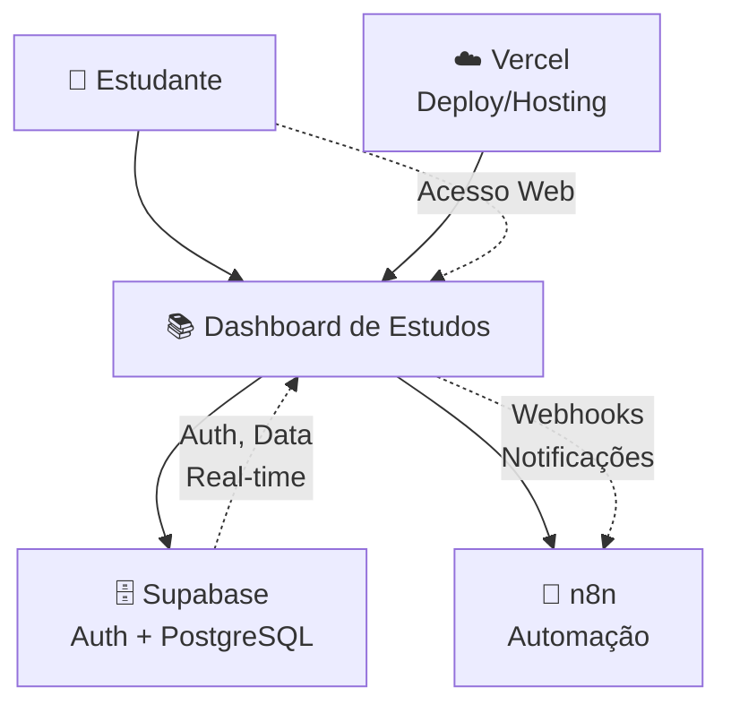
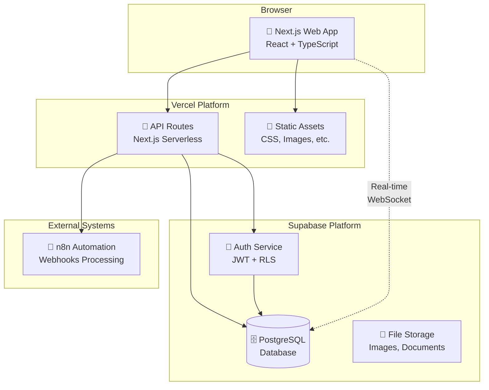
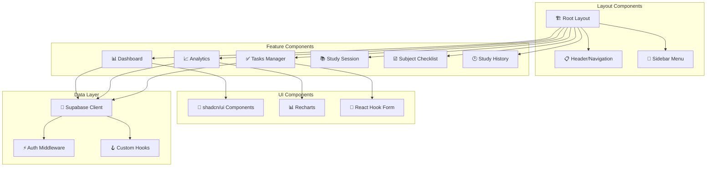
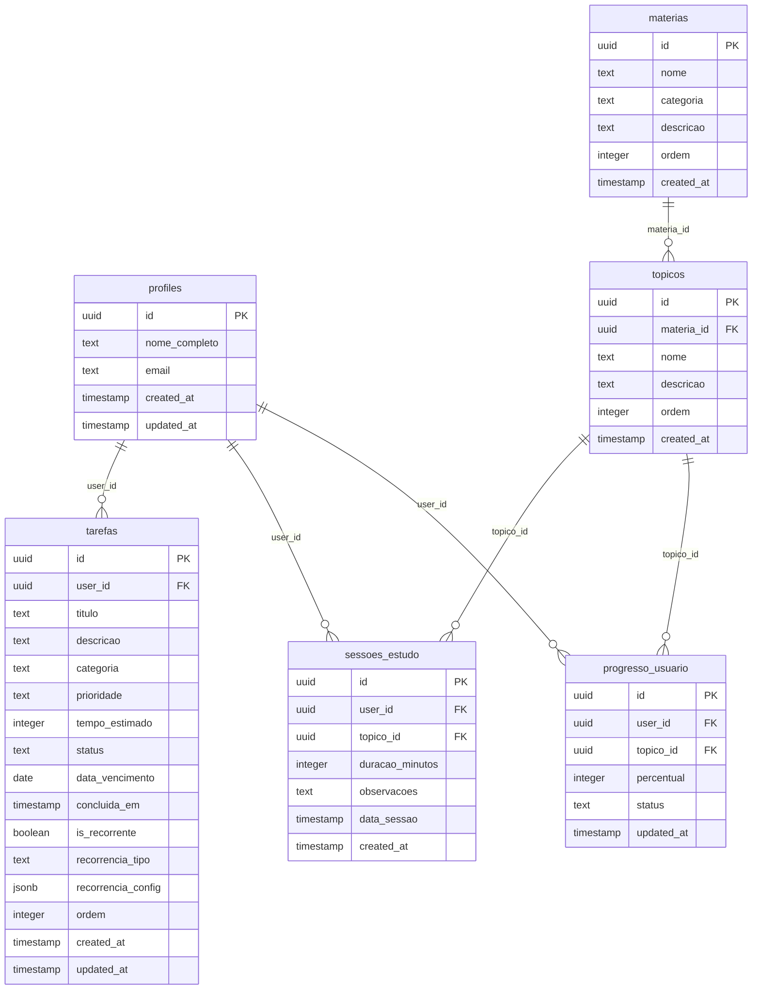

# Documentação de Arquitetura - Dashboard de Estudos

Esta documentação segue o modelo C4 para descrever a arquitetura do sistema de dashboard de estudos e tarefas.

## Índice

1. [Visão Geral do Sistema](#visão-geral-do-sistema)
2. [Contexto (C1)](#contexto-c1)
3. [Containers (C2)](#containers-c2)
4. [Componentes (C3)](#componentes-c3)
5. [Decisões Arquiteturais](#decisões-arquiteturais)
6. [Schema do Banco de Dados](#schema-do-banco-de-dados)

## Visão Geral do Sistema

O Dashboard de Estudos é uma aplicação web desenvolvida para auxiliar estudantes na preparação para concursos públicos, especificamente para o concurso da ASOF (Analista de Sistemas e Finanças). O sistema oferece funcionalidades de:

- Acompanhamento de progresso nos estudos
- Gestão de sessões de estudo
- Sistema de tarefas diárias
- Analytics e visualização de dados
- Checklist do edital do concurso

## Contexto (C1)

### Usuários do Sistema

- **Estudante Principal**: Usuário que utiliza o sistema para organizar e acompanhar seus estudos
- **Sistema de Automação n8n**: Sistema externo que processará webhooks para automação de workflows

### Sistemas Externos

- **Supabase**: Plataforma BaaS (Backend as a Service) que fornece:
  - Autenticação de usuários
  - Banco de dados PostgreSQL
  - API REST automática
  - Real-time subscriptions
  - Row Level Security (RLS)

- **Vercel**: Plataforma de deploy e hosting para aplicações Next.js

### Diagrama de Contexto (Mermaid)



## Containers (C2)

### Frontend Web Application

- **Tecnologia**: Next.js 15 + React 19 + TypeScript
- **Funcionalidades**:
  - Interface de usuário responsiva
  - Gerenciamento de estado local
  - Roteamento com App Router
  - SSR/SSG para performance

### Backend API

- **Tecnologia**: Next.js API Routes + Supabase
- **Funcionalidades**:
  - API endpoints customizados
  - Middleware de autenticação
  - Integração com webhooks
  - Processamento de dados

### Database

- **Tecnologia**: PostgreSQL (Supabase)
- **Características**:
  - Row Level Security (RLS)
  - Triggers e funções
  - Schemas otimizados
  - Backup automático

### Diagrama de Containers (Mermaid)



## Componentes (C3)

### Estrutura de Componentes React



### Arquitetura de Páginas (App Router)

```
/app/
├── layout.tsx                 # Root layout
├── page.tsx                   # Home page
├── dashboard/
│   └── page.tsx              # Dashboard principal
├── analytics/
│   └── page.tsx              # Página de analytics
├── tasks/
│   └── page.tsx              # Gerenciamento de tarefas
├── study-session/
│   └── page.tsx              # Interface de sessão de estudo
├── study-history/
│   └── page.tsx              # Histórico de estudos
├── checklist/
│   └── page.tsx              # Checklist do edital
└── auth/
    ├── login/
    │   └── page.tsx          # Página de login
    └── sign-up/
        └── page.tsx          # Página de cadastro
```

## Decisões Arquiteturais

### ADR-001: Escolha do Framework Frontend

**Status**: Aceito  
**Data**: 2024  

**Contexto**: Necessidade de um framework React moderno com SSR/SSG e boa developer experience.

**Decisão**: Next.js 15 com App Router

**Consequências**:
- ✅ Melhor SEO com SSR
- ✅ Performance otimizada
- ✅ Ecossistema robusto
- ⚠️ Curva de aprendizado do App Router

### ADR-002: Escolha do Backend as a Service

**Status**: Aceito  
**Data**: 2024  

**Contexto**: Necessidade de backend rápido e escalável sem gerenciamento de infraestrutura.

**Decisão**: Supabase (PostgreSQL + Auth + Real-time)

**Consequências**:
- ✅ Desenvolvimento mais rápido
- ✅ Auth integrado
- ✅ Real-time out-of-the-box
- ⚠️ Vendor lock-in parcial

### ADR-003: Estratégia de UI/UX

**Status**: Aceito  
**Data**: 2024  

**Contexto**: Necessidade de UI consistente e acessível.

**Decisão**: shadcn/ui + Tailwind CSS + Radix UI

**Consequências**:
- ✅ Componentes acessíveis
- ✅ Consistência visual
- ✅ Customização flexível
- ✅ TypeScript first

## Schema do Banco de Dados

### Diagrama de Entidades (ERD)



### Principais Entidades

#### profiles
- Perfis de usuário vinculados ao sistema de auth do Supabase
- RLS: usuários só acessam seus próprios dados

#### materias
- Matérias do concurso (básicas e específicas)
- Dados públicos para todos os usuários

#### topicos
- Tópicos específicos de cada matéria
- Estrutura hierárquica para organização do conteúdo

#### progresso_usuario
- Progresso individual do usuário em cada tópico
- Percentual de conclusão e status

#### sessoes_estudo
- Registro de sessões de estudo
- Duração, observações e vinculação a tópicos

#### tarefas
- Sistema de tarefas diárias com categorização
- Suporte a recorrência e priorização

## Padrões de Desenvolvimento

### Estrutura de Pastas

```
/components/
├── ui/                       # Componentes base (shadcn/ui)
├── dashboard/                # Componentes específicos do dashboard
├── analytics/                # Componentes de analytics
├── tasks/                    # Componentes de tarefas
├── auth/                     # Componentes de autenticação
└── [feature]/                # Componentes organizados por feature
```

### Convenções de Nomenclatura

- **Componentes**: PascalCase (`TaskItem.tsx`)
- **Arquivos**: kebab-case (`task-item.tsx`)
- **Variáveis**: camelCase (`userName`)
- **Constantes**: UPPER_SNAKE_CASE (`API_URL`)

### Padrões de Estado

- **Local State**: useState para estado simples
- **Form State**: React Hook Form + Zod para validação
- **Server State**: Supabase real-time subscriptions
- **Global State**: Context API quando necessário

## Segurança

### Row Level Security (RLS)

Todas as tabelas implementam RLS para garantir que usuários só acessem seus próprios dados:

```sql
-- Exemplo: política para tarefas
create policy "tarefas_select_own"
  on public.tarefas for select
  using (auth.uid() = user_id);
```

### Autenticação

- JWT tokens gerenciados pelo Supabase
- Middleware de autenticação em todas as rotas protegidas
- Redirect automático para login quando necessário

## Performance

### Otimizações Implementadas

1. **Next.js Otimizações**:
   - SSG para páginas estáticas
   - ISR para conteúdo dinâmico
   - Image optimization automática

2. **Database**:
   - Índices otimizados
   - Queries eficientes
   - Connection pooling (Supabase)

3. **Frontend**:
   - Lazy loading de componentes
   - Memoização com React.memo
   - Debounce em inputs de busca

## Monitoramento

### Logs e Observabilidade

- Logs de aplicação estruturados
- Monitoring via Vercel Analytics
- Error tracking para debugging

### Métricas de Negócio

- Taxa de conclusão de tarefas
- Tempo médio de sessões de estudo
- Progresso nos tópicos do edital

## Roadmap de Desenvolvimento

O desenvolvimento segue fases incrementais definidas no ROADMAP.md:

1. ✅ **Estrutura Base**: Layout, auth, navegação
2. ✅ **Indicadores Básicos**: KPIs, métricas iniciais
3. ✅ **Controle de Matérias**: CRUD de progresso
4. ✅ **Linha do Tempo**: Analytics e visualizações
5. ✅ **Refinamentos**: UX e performance
6. ✅ **Tarefas Diárias**: Sistema completo de tasks
7. 🔄 **Integração n8n**: Webhooks e automação

---

**Última atualização**: Agosto 2024  
**Versão da documentação**: 1.0