# Diagramas de Fluxo de Dados - Dashboard de Estudos

Esta documentação apresenta os principais fluxos de dados do sistema, organizados por funcionalidade.

## Índice

1. [Fluxo de Autenticação](#fluxo-de-autenticação)
2. [Fluxo de Tarefas](#fluxo-de-tarefas)
3. [Fluxo de Sessões de Estudo](#fluxo-de-sessões-de-estudo)
4. [Fluxo de Progress Tracking](#fluxo-de-progress-tracking)
5. [Fluxo de Analytics](#fluxo-de-analytics)
6. [Arquitetura de Componentes](#arquitetura-de-componentes)

## Fluxo de Autenticação

### Processo de Login/Cadastro

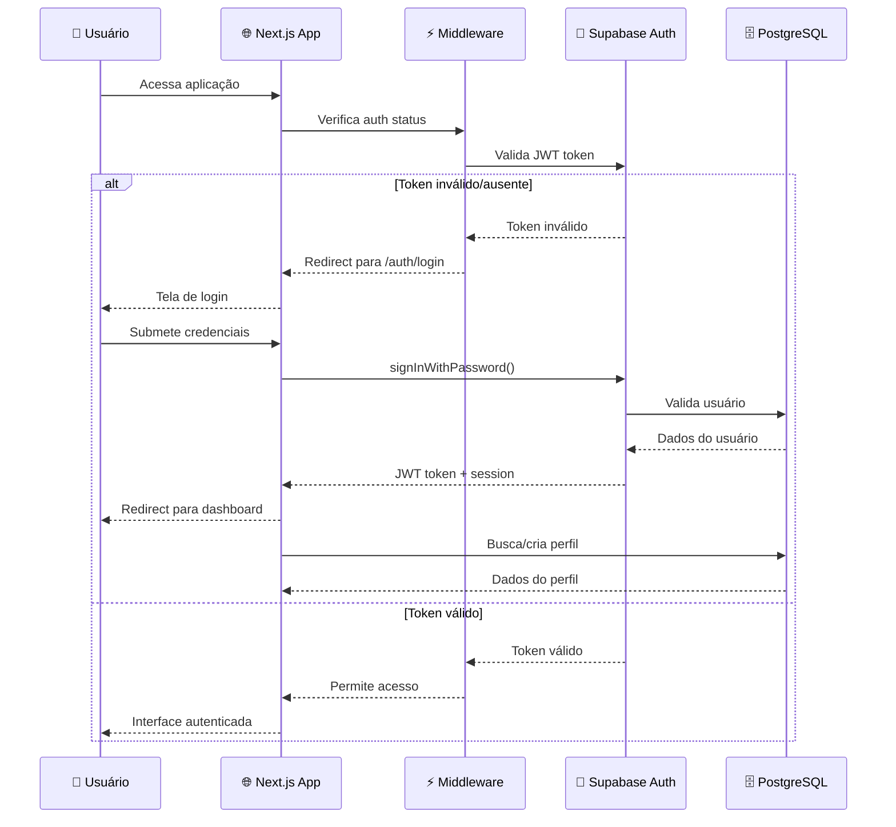
```mermaid
sequenceDiagram
    participant User as 👤 Usuário
    participant Web as 🌐 Next.js App
    participant MW as ⚡ Middleware
    participant Auth as 🔐 Supabase Auth
    participant DB as 🗄️ PostgreSQL
    
    User->>Web: Acessa aplicação
    Web->>MW: Verifica auth status
    MW->>Auth: Valida JWT token
    
    alt Token inválido/ausente
        Auth-->>MW: Token inválido
        MW-->>Web: Redirect para /auth/login
        Web-->>User: Tela de login
        
        User->>Web: Submete credenciais
        Web->>Auth: signInWithPassword()
        Auth->>DB: Valida usuário
        DB-->>Auth: Dados do usuário
        Auth-->>Web: JWT token + session
        Web-->>User: Redirect para dashboard
        
        Web->>DB: Busca/cria perfil
        DB-->>Web: Dados do perfil
    else Token válido
        Auth-->>MW: Token válido
        MW-->>Web: Permite acesso
        Web-->>User: Interface autenticada
    end
```

### Estados de Autenticação

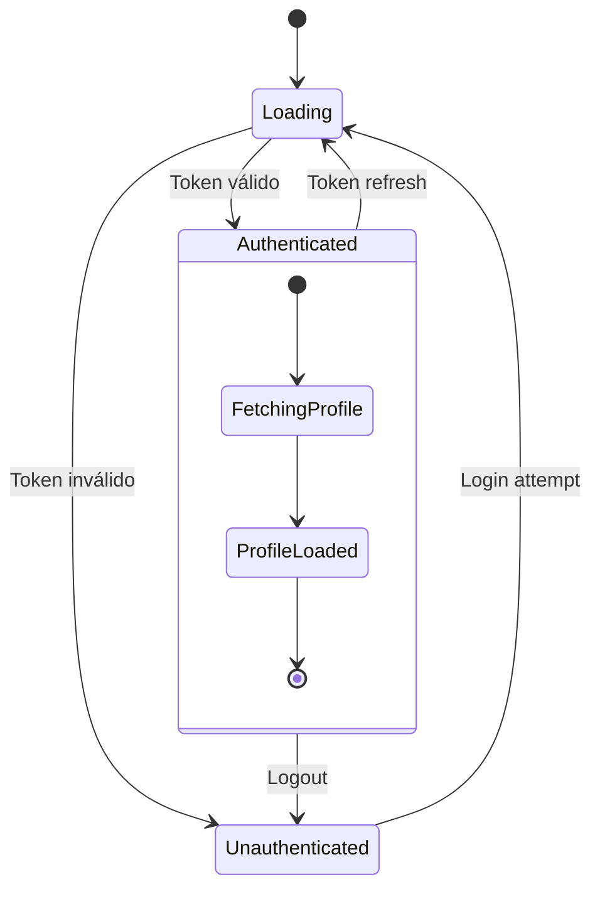
```mermaid
stateDiagram-v2
    [*] --> Loading
    Loading --> Unauthenticated : Token inválido
    Loading --> Authenticated : Token válido
    
    Unauthenticated --> Loading : Login attempt
    Authenticated --> Loading : Token refresh
    Authenticated --> Unauthenticated : Logout
    
    state Authenticated {
        [*] --> FetchingProfile
        FetchingProfile --> ProfileLoaded
        ProfileLoaded --> [*]
    }
```

## Fluxo de Tarefas

### Criação e Gerenciamento de Tarefas

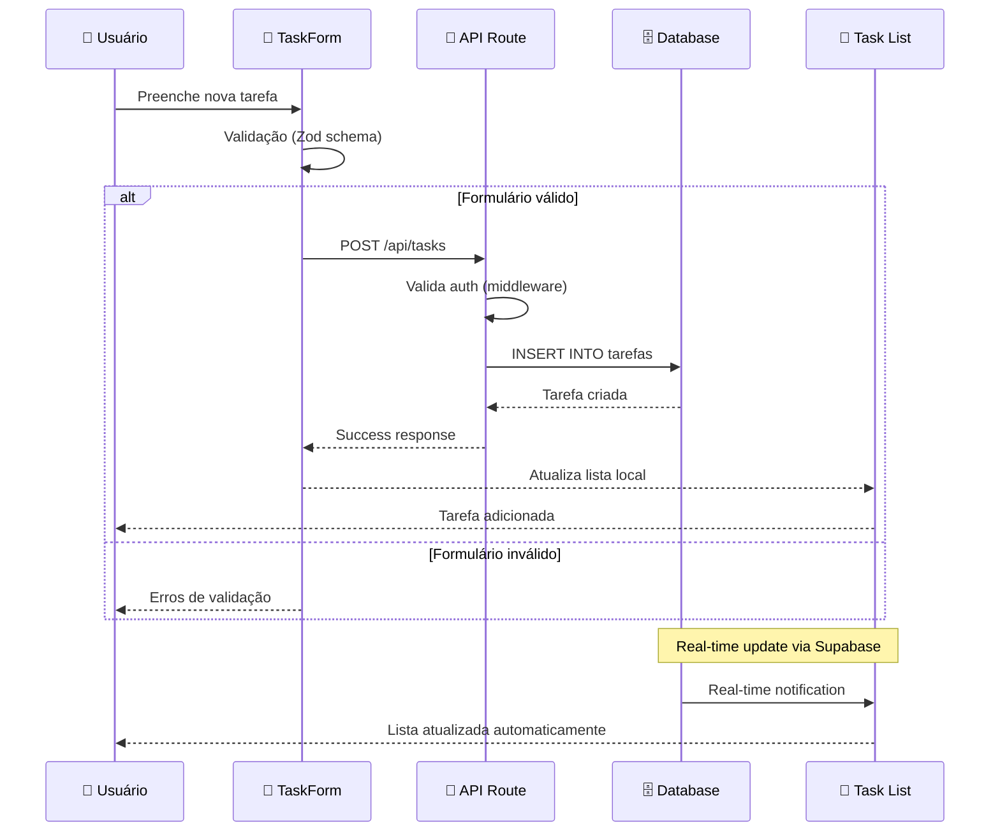
```mermaid
sequenceDiagram
    participant User as 👤 Usuário
    participant Form as 📝 TaskForm
    participant API as 🔧 API Route
    participant DB as 🗄️ Database
    participant UI as 🎨 Task List
    
    User->>Form: Preenche nova tarefa
    Form->>Form: Validação (Zod schema)
    
    alt Formulário válido
        Form->>API: POST /api/tasks
        API->>API: Valida auth (middleware)
        API->>DB: INSERT INTO tarefas
        DB-->>API: Tarefa criada
        API-->>Form: Success response
        Form-->>UI: Atualiza lista local
        UI-->>User: Tarefa adicionada
    else Formulário inválido
        Form-->>User: Erros de validação
    end
    
    Note over DB,UI: Real-time update via Supabase
    DB->>UI: Real-time notification
    UI-->>User: Lista atualizada automaticamente
```

### Estados da Tarefa

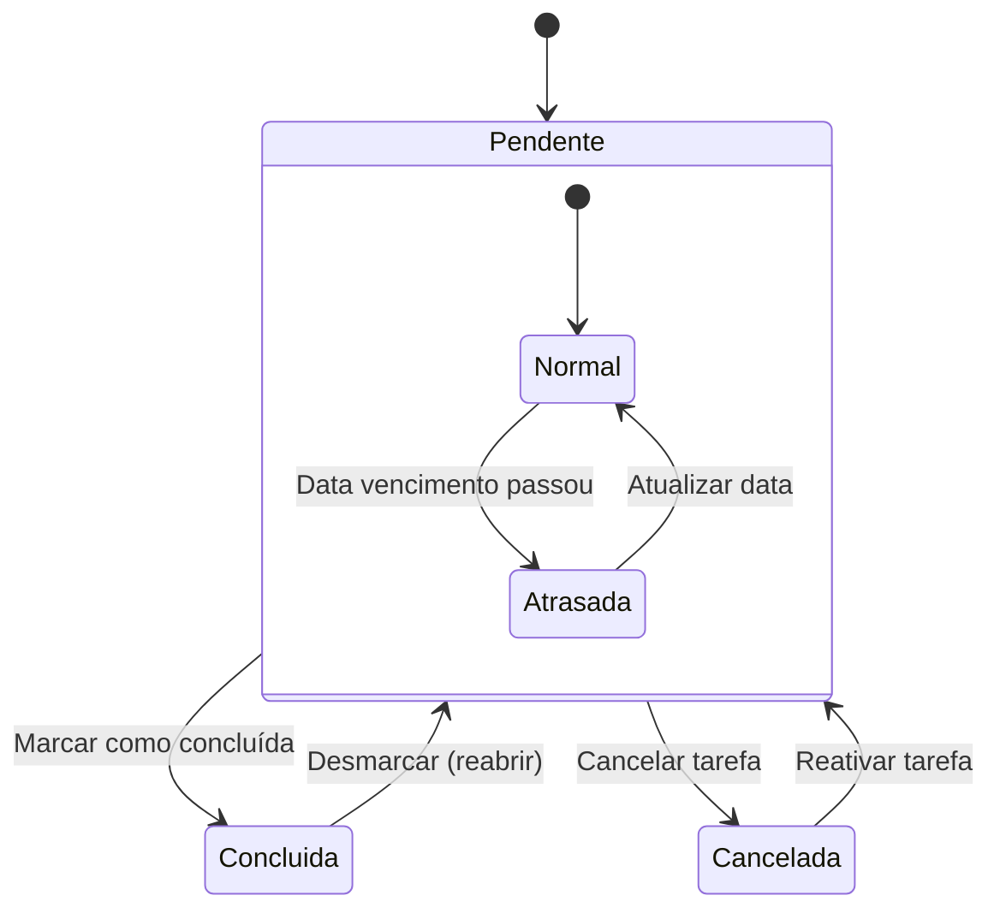
```mermaid
stateDiagram-v2
    [*] --> Pendente
    Pendente --> Concluida : Marcar como concluída
    Pendente --> Cancelada : Cancelar tarefa
    Concluida --> Pendente : Desmarcar (reabrir)
    Cancelada --> Pendente : Reativar tarefa
    
    state Pendente {
        [*] --> Normal
        Normal --> Atrasada : Data vencimento passou
        Atrasada --> Normal : Atualizar data
    }
```

### Fluxo de Recorrência de Tarefas

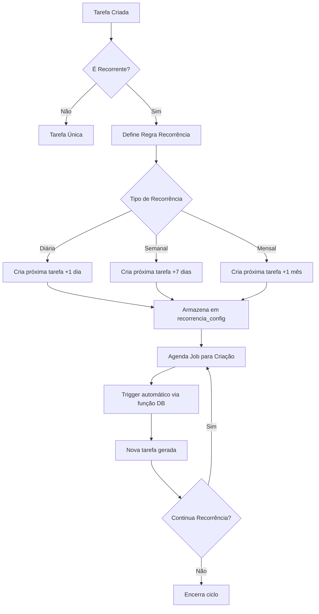
```mermaid
flowchart TD
    A[Tarefa Criada] --> B{É Recorrente?}
    B -->|Não| C[Tarefa Única]
    B -->|Sim| D[Define Regra Recorrência]
    
    D --> E{Tipo de Recorrência}
    E -->|Diária| F[Cria próxima tarefa +1 dia]
    E -->|Semanal| G[Cria próxima tarefa +7 dias]
    E -->|Mensal| H[Cria próxima tarefa +1 mês]
    
    F --> I[Armazena em recorrencia_config]
    G --> I
    H --> I
    
    I --> J[Agenda Job para Criação]
    J --> K[Trigger automático via função DB]
    K --> L[Nova tarefa gerada]
    L --> M{Continua Recorrência?}
    M -->|Sim| J
    M -->|Não| N[Encerra ciclo]
```

## Fluxo de Sessões de Estudo

### Iniciando uma Sessão

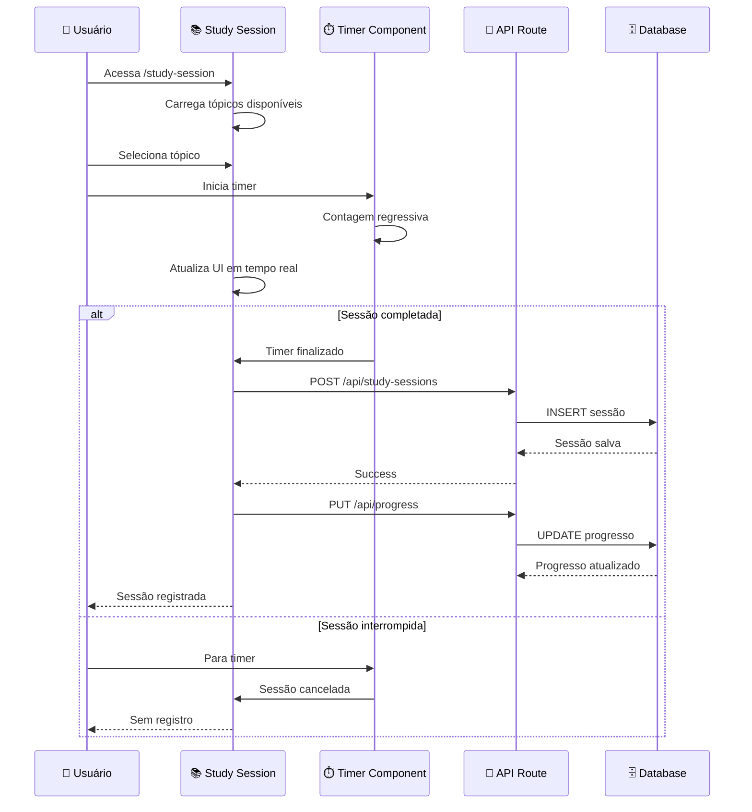
```mermaid
sequenceDiagram
    participant User as 👤 Usuário
    participant Page as 📚 Study Session
    participant Timer as ⏱️ Timer Component
    participant API as 🔧 API Route
    participant DB as 🗄️ Database
    
    User->>Page: Acessa /study-session
    Page->>Page: Carrega tópicos disponíveis
    User->>Page: Seleciona tópico
    User->>Timer: Inicia timer
    
    Timer->>Timer: Contagem regressiva
    Page->>Page: Atualiza UI em tempo real
    
    alt Sessão completada
        Timer->>Page: Timer finalizado
        Page->>API: POST /api/study-sessions
        API->>DB: INSERT sessão
        DB-->>API: Sessão salva
        API-->>Page: Success
        Page->>API: PUT /api/progress
        API->>DB: UPDATE progresso
        DB-->>API: Progresso atualizado
        Page-->>User: Sessão registrada
    else Sessão interrompida
        User->>Timer: Para timer
        Timer->>Page: Sessão cancelada
        Page-->>User: Sem registro
    end
```

### Cálculo de Progresso

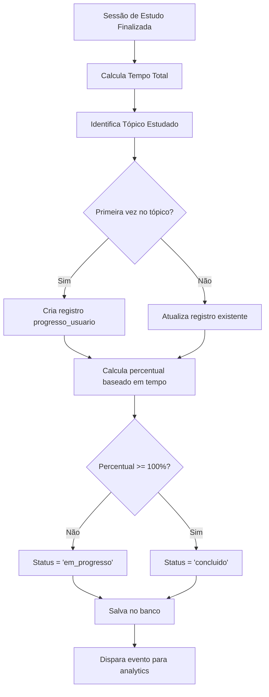
```mermaid
flowchart TD
    A[Sessão de Estudo Finalizada] --> B[Calcula Tempo Total]
    B --> C[Identifica Tópico Estudado]
    C --> D{Primeira vez no tópico?}
    
    D -->|Sim| E[Cria registro progresso_usuario]
    D -->|Não| F[Atualiza registro existente]
    
    E --> G[Calcula percentual baseado em tempo]
    F --> G
    
    G --> H{Percentual >= 100%?}
    H -->|Não| I[Status = 'em_progresso']
    H -->|Sim| J[Status = 'concluido']
    
    I --> K[Salva no banco]
    J --> K
    K --> L[Dispara evento para analytics]
```

## Fluxo de Progress Tracking

### Atualização de Progresso

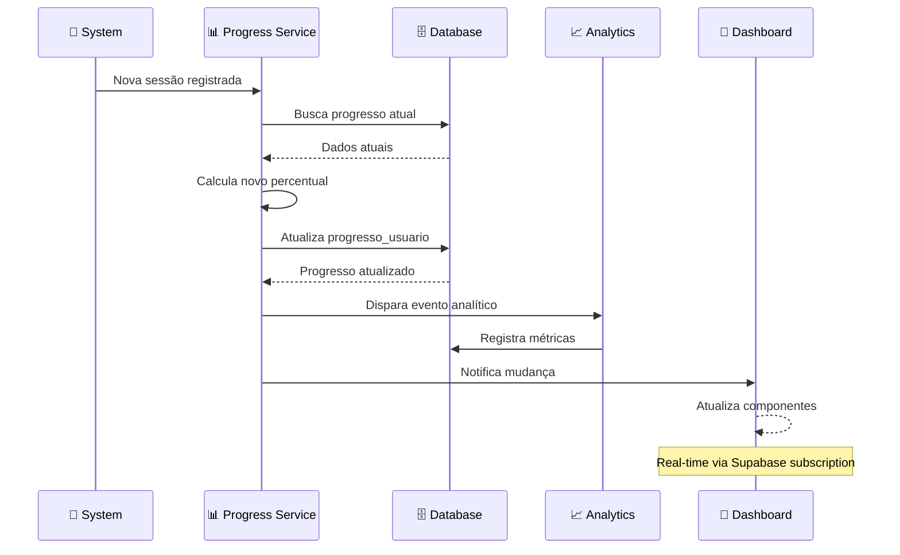
```mermaid
sequenceDiagram
    participant System as 🔧 System
    participant Progress as 📊 Progress Service
    participant DB as 🗄️ Database
    participant Analytics as 📈 Analytics
    participant UI as 🎨 Dashboard
    
    System->>Progress: Nova sessão registrada
    Progress->>DB: Busca progresso atual
    DB-->>Progress: Dados atuais
    
    Progress->>Progress: Calcula novo percentual
    Progress->>DB: Atualiza progresso_usuario
    DB-->>Progress: Progresso atualizado
    
    Progress->>Analytics: Dispara evento analítico
    Analytics->>DB: Registra métricas
    
    Progress->>UI: Notifica mudança
    UI-->>UI: Atualiza componentes
    
    Note over UI: Real-time via Supabase subscription
```

### Algoritmo de Cálculo de Progresso

```mermaid
flowchart TD
    A[Sessão de Estudo] --> B[Extrai: tópico_id, duração]
    B --> C[Busca meta de tempo do tópico]
    C --> D[Soma tempo total estudado]
    D --> E[Calcula: (tempo_atual / tempo_meta) * 100]
    
    E --> F{Percentual > 100?}
    F -->|Sim| G[Limita a 100%]
    F -->|Não| H[Mantém percentual calculado]
    
    G --> I[Define status baseado no percentual]
    H --> I
    
    I --> J{Percentual = 0?}
    J -->|Sim| K[Status: 'nao_iniciado']
    J -->|Não| L{Percentual < 100?}
    
    L -->|Sim| M[Status: 'em_progresso']
    L -->|Não| N[Status: 'concluido']
    
    K --> O[Salva no banco]
    M --> O
    N --> O
```

## Fluxo de Analytics

### Geração de Métricas

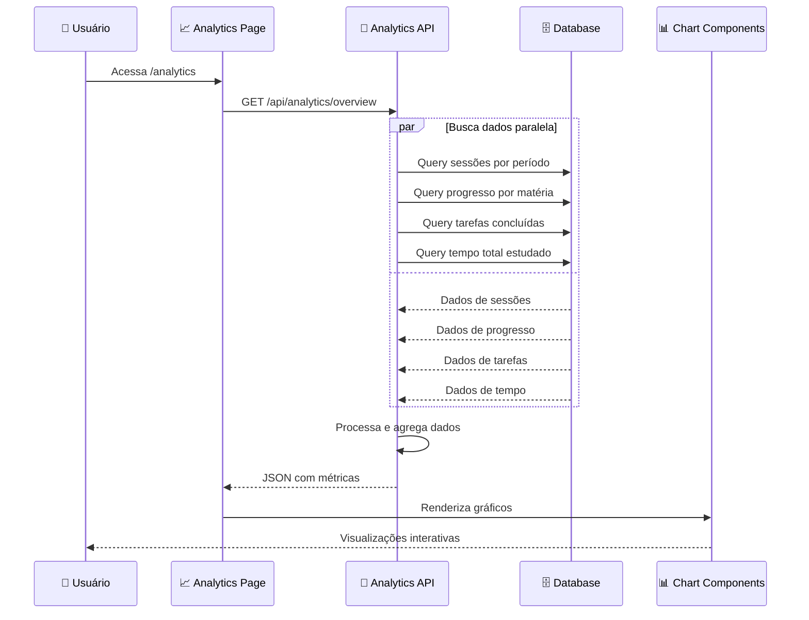
```mermaid
sequenceDiagram
    participant User as 👤 Usuário
    participant Page as 📈 Analytics Page
    participant API as 🔧 Analytics API
    participant DB as 🗄️ Database
    participant Charts as 📊 Chart Components
    
    User->>Page: Acessa /analytics
    Page->>API: GET /api/analytics/overview
    
    par Busca dados paralela
        API->>DB: Query sessões por período
        API->>DB: Query progresso por matéria
        API->>DB: Query tarefas concluídas
        API->>DB: Query tempo total estudado
    and
        DB-->>API: Dados de sessões
        DB-->>API: Dados de progresso
        DB-->>API: Dados de tarefas
        DB-->>API: Dados de tempo
    end
    
    API->>API: Processa e agrega dados
    API-->>Page: JSON com métricas
    
    Page->>Charts: Renderiza gráficos
    Charts-->>User: Visualizações interativas
```

### Pipeline de Dados Analytics

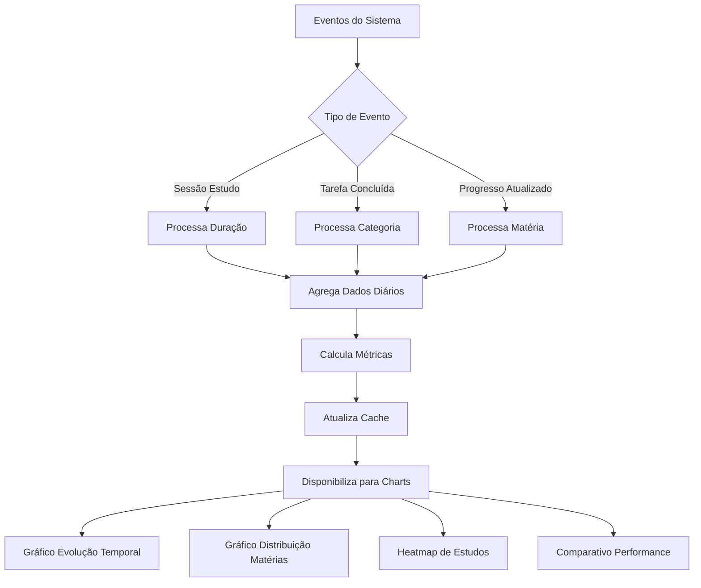
```mermaid
flowchart TD
    A[Eventos do Sistema] --> B{Tipo de Evento}
    
    B -->|Sessão Estudo| C[Processa Duração]
    B -->|Tarefa Concluída| D[Processa Categoria]
    B -->|Progresso Atualizado| E[Processa Matéria]
    
    C --> F[Agrega Dados Diários]
    D --> F
    E --> F
    
    F --> G[Calcula Métricas]
    G --> H[Atualiza Cache]
    H --> I[Disponibiliza para Charts]
    
    I --> J[Gráfico Evolução Temporal]
    I --> K[Gráfico Distribuição Matérias]
    I --> L[Heatmap de Estudos]
    I --> M[Comparativo Performance]
```

## Arquitetura de Componentes

### Hierarquia de Componentes React

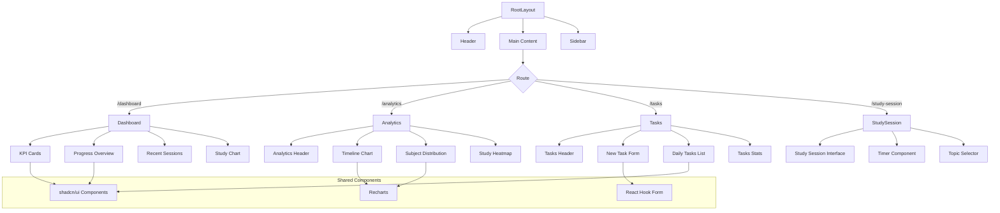
```mermaid
graph TD
    A[RootLayout] --> B[Header]
    A --> C[Main Content]
    A --> D[Sidebar]
    
    C --> E{Route}
    E -->|/dashboard| F[Dashboard]
    E -->|/analytics| G[Analytics]
    E -->|/tasks| H[Tasks]
    E -->|/study-session| I[StudySession]
    
    F --> F1[KPI Cards]
    F --> F2[Progress Overview]
    F --> F3[Recent Sessions]
    F --> F4[Study Chart]
    
    G --> G1[Analytics Header]
    G --> G2[Timeline Chart]
    G --> G3[Subject Distribution]
    G --> G4[Study Heatmap]
    
    H --> H1[Tasks Header]
    H --> H2[New Task Form]
    H --> H3[Daily Tasks List]
    H --> H4[Tasks Stats]
    
    I --> I1[Study Session Interface]
    I --> I2[Timer Component]
    I --> I3[Topic Selector]
    
    subgraph "Shared Components"
        UI[shadcn/ui Components]
        Forms[React Hook Form]
        Charts[Recharts]
    end
    
    F1 --> UI
    F2 --> UI
    G2 --> Charts
    G3 --> Charts
    H2 --> Forms
    H3 --> UI
```

### Padrão de Comunicação entre Componentes

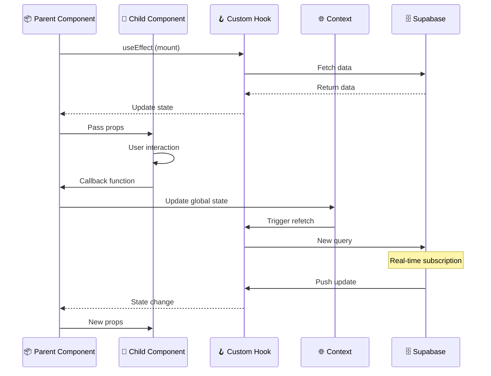
```mermaid
sequenceDiagram
    participant Parent as 📦 Parent Component
    participant Child as 🧩 Child Component
    participant Hook as 🪝 Custom Hook
    participant Context as 🌐 Context
    participant Supabase as 🗄️ Supabase
    
    Parent->>Hook: useEffect (mount)
    Hook->>Supabase: Fetch data
    Supabase-->>Hook: Return data
    Hook-->>Parent: Update state
    Parent->>Child: Pass props
    
    Child->>Child: User interaction
    Child->>Parent: Callback function
    Parent->>Context: Update global state
    Context->>Hook: Trigger refetch
    Hook->>Supabase: New query
    
    Note over Supabase: Real-time subscription
    Supabase->>Hook: Push update
    Hook-->>Parent: State change
    Parent->>Child: New props
```

### Padrão de Gerenciamento de Estado

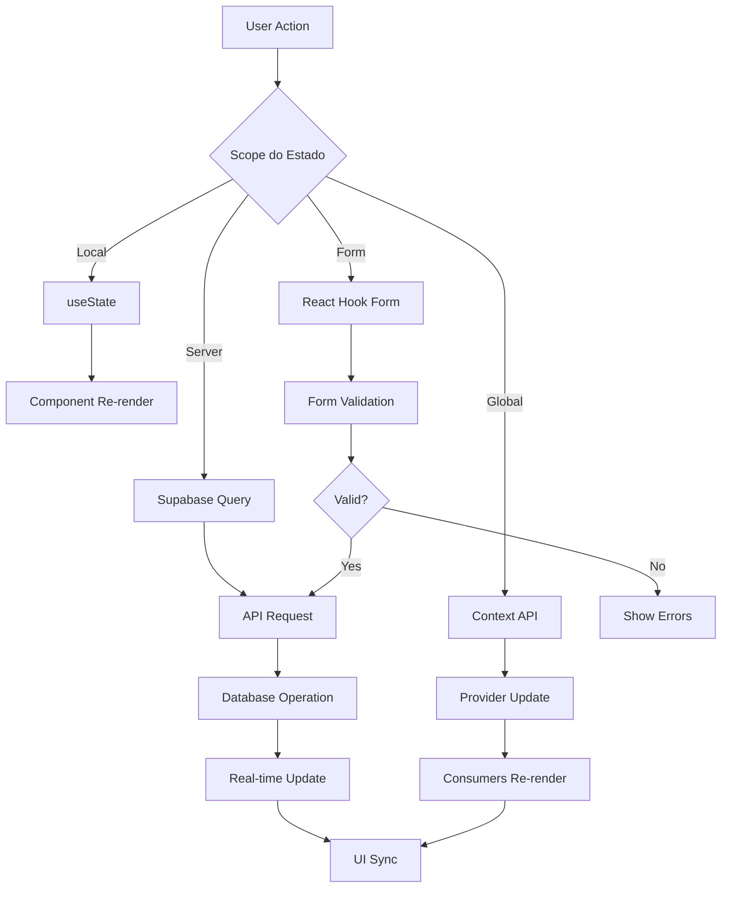
```mermaid
flowchart TD
    A[User Action] --> B{Scope do Estado}
    
    B -->|Local| C[useState]
    B -->|Form| D[React Hook Form]
    B -->|Server| E[Supabase Query]
    B -->|Global| F[Context API]
    
    C --> G[Component Re-render]
    D --> H[Form Validation]
    E --> I[API Request]
    F --> J[Provider Update]
    
    H --> K{Valid?}
    K -->|Yes| I
    K -->|No| L[Show Errors]
    
    I --> M[Database Operation]
    M --> N[Real-time Update]
    N --> O[UI Sync]
    
    J --> P[Consumers Re-render]
    P --> O
```

## Otimizações de Performance

### Lazy Loading Strategy

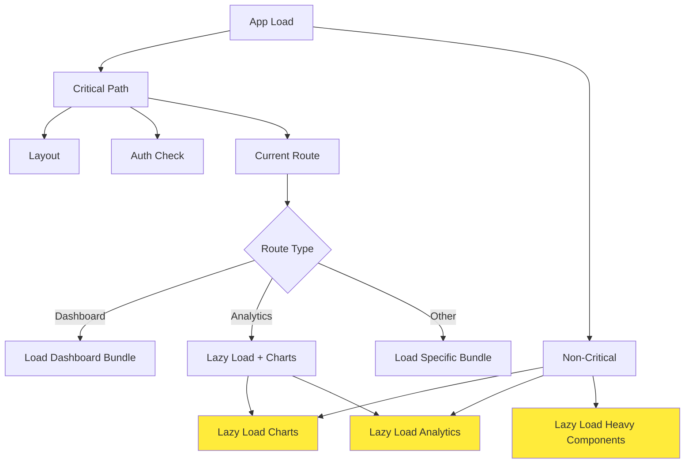
```mermaid
flowchart TD
    A[App Load] --> B[Critical Path]
    A --> C[Non-Critical]
    
    B --> B1[Layout]
    B --> B2[Auth Check]
    B --> B3[Current Route]
    
    C --> C1[Lazy Load Charts]
    C --> C2[Lazy Load Analytics]
    C --> C3[Lazy Load Heavy Components]
    
    B3 --> D{Route Type}
    D -->|Dashboard| E[Load Dashboard Bundle]
    D -->|Analytics| F[Lazy Load + Charts]
    D -->|Other| G[Load Specific Bundle]
    
    F --> C1
    F --> C2
    
    style C1 fill:#ffeb3b
    style C2 fill:#ffeb3b
    style C3 fill:#ffeb3b
```

### Caching Strategy

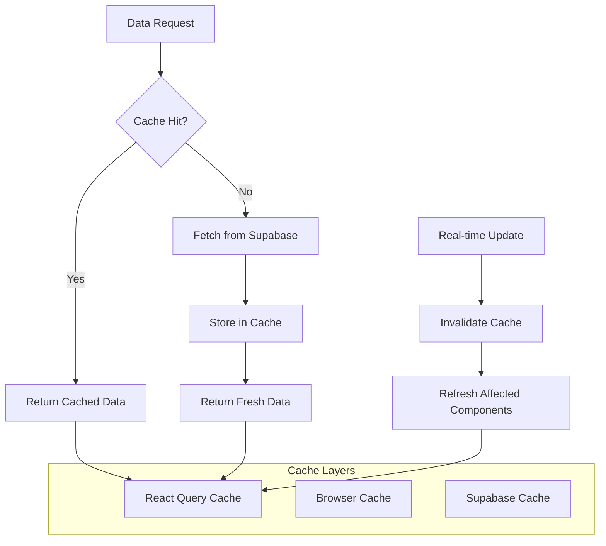
```mermaid
flowchart TD
    A[Data Request] --> B{Cache Hit?}
    
    B -->|Yes| C[Return Cached Data]
    B -->|No| D[Fetch from Supabase]
    
    D --> E[Store in Cache]
    E --> F[Return Fresh Data]
    
    G[Real-time Update] --> H[Invalidate Cache]
    H --> I[Refresh Affected Components]
    
    subgraph "Cache Layers"
        J[React Query Cache]
        K[Browser Cache]
        L[Supabase Cache]
    end
    
    C --> J
    F --> J
    I --> J
```

---

**Última atualização**: Agosto 2024  
**Versão da documentação**: 1.0