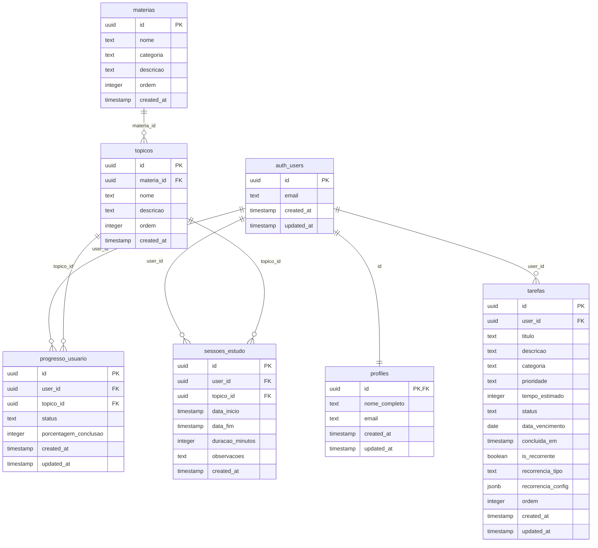

# Documentação do Schema do Banco de Dados

Este documento detalha o schema completo do banco de dados PostgreSQL (Supabase) utilizado no Dashboard de Estudos.

## Índice

1. [Visão Geral](#visão-geral)
2. [Diagrama Entidade-Relacionamento](#diagrama-entidade-relacionamento)
3. [Tabelas](#tabelas)
4. [Políticas de Segurança (RLS)](#políticas-de-segurança-rls)
5. [Triggers e Funções](#triggers-e-funções)
6. [Índices e Performance](#índices-e-performance)
7. [Constraints e Validações](#constraints-e-validações)

## Visão Geral

O banco de dados está estruturado para suportar um sistema de dashboard de estudos com as seguintes funcionalidades principais:

- **Gestão de Usuários**: Perfis integrados com auth do Supabase
- **Conteúdo Acadêmico**: Matérias e tópicos do edital
- **Progress Tracking**: Acompanhamento de progresso individual
- **Sessões de Estudo**: Registro de tempo e atividades
- **Sistema de Tarefas**: Tarefas diárias com recorrência

### Características Técnicas

- **SGBD**: PostgreSQL 15+ (Supabase)
- **Autenticação**: Supabase Auth integrado
- **Segurança**: Row Level Security (RLS) em todas as tabelas
- **Performance**: Índices otimizados para queries frequentes
- **Escalabilidade**: UUIDs como chaves primárias

## Diagrama Entidade-Relacionamento



## Tabelas

### 1. profiles

Perfis de usuário vinculados ao sistema de autenticação do Supabase.

```sql
CREATE TABLE public.profiles (
    id UUID PRIMARY KEY REFERENCES auth.users(id) ON DELETE CASCADE,
    nome_completo TEXT,
    email TEXT,
    created_at TIMESTAMP WITH TIME ZONE DEFAULT timezone('utc'::text, now()) NOT NULL,
    updated_at TIMESTAMP WITH TIME ZONE DEFAULT timezone('utc'::text, now()) NOT NULL
);
```

**Características:**
- Chave primária é uma referência direta ao `auth.users`
- Cascade delete para limpeza automática
- Campos opcionais para flexibilidade inicial

### 2. materias

Matérias do concurso público organizadas por categoria.

```sql
CREATE TABLE public.materias (
    id UUID PRIMARY KEY DEFAULT gen_random_uuid(),
    nome TEXT NOT NULL,
    categoria TEXT NOT NULL, -- 'basicos' ou 'especificos'
    descricao TEXT,
    ordem INTEGER NOT NULL,
    created_at TIMESTAMP WITH TIME ZONE DEFAULT timezone('utc'::text, now()) NOT NULL
);
```

**Dados Pré-cadastrados:**
- **Conhecimentos Básicos** (10 matérias):
  - Língua Portuguesa, Inglesa, Matemática Financeira
  - Controle Externo, Administração Pública
  - Direito Constitucional, Administrativo, Civil, Processual Civil
  - Sistema Normativo Anticorrupção

- **Conhecimentos Específicos** (7 matérias):
  - Estatística, Análise de Dados, Auditoria Governamental
  - Contabilidade do Setor Público, Análise das Demonstrações Contábeis
  - Administração Financeira e Orçamentária, Economia do Setor Público

### 3. topicos

Tópicos específicos dentro de cada matéria para granularidade no acompanhamento.

```sql
CREATE TABLE public.topicos (
    id UUID PRIMARY KEY DEFAULT gen_random_uuid(),
    materia_id UUID NOT NULL REFERENCES public.materias(id) ON DELETE CASCADE,
    nome TEXT NOT NULL,
    descricao TEXT,
    ordem INTEGER NOT NULL,
    created_at TIMESTAMP WITH TIME ZONE DEFAULT timezone('utc'::text, now()) NOT NULL
);
```

**Características:**
- Relacionamento N:1 com materias
- Ordem para apresentação hierárquica
- Cascade delete para integridade referencial

### 4. progresso_usuario

Acompanhamento individualizado do progresso do usuário em cada tópico.

```sql
CREATE TABLE public.progresso_usuario (
    id UUID PRIMARY KEY DEFAULT gen_random_uuid(),
    user_id UUID NOT NULL REFERENCES auth.users(id) ON DELETE CASCADE,
    topico_id UUID NOT NULL REFERENCES public.topicos(id) ON DELETE CASCADE,
    status TEXT NOT NULL DEFAULT 'nao_iniciado', 
    porcentagem_conclusao INTEGER DEFAULT 0 CHECK (porcentagem_conclusao >= 0 AND porcentagem_conclusao <= 100),
    created_at TIMESTAMP WITH TIME ZONE DEFAULT timezone('utc'::text, now()) NOT NULL,
    updated_at TIMESTAMP WITH TIME ZONE DEFAULT timezone('utc'::text, now()) NOT NULL,
    UNIQUE(user_id, topico_id)
);
```

**Estados Possíveis:**
- `nao_iniciado`: Tópico ainda não foi estudado
- `em_progresso`: Estudos iniciados, mas não concluídos  
- `concluido`: Tópico completamente dominado

**Características:**
- Constraint UNIQUE para evitar duplicatas
- Check constraint na porcentagem (0-100)
- Trigger para updated_at automático

### 5. sessoes_estudo

Registro de sessões de estudo realizadas pelo usuário.

```sql
CREATE TABLE public.sessoes_estudo (
    id UUID PRIMARY KEY DEFAULT gen_random_uuid(),
    user_id UUID NOT NULL REFERENCES auth.users(id) ON DELETE CASCADE,
    topico_id UUID NOT NULL REFERENCES public.topicos(id) ON DELETE CASCADE,
    data_inicio TIMESTAMP WITH TIME ZONE NOT NULL,
    data_fim TIMESTAMP WITH TIME ZONE,
    duracao_minutos INTEGER,
    observacoes TEXT,
    created_at TIMESTAMP WITH TIME ZONE DEFAULT timezone('utc'::text, now()) NOT NULL
);
```

**Funcionalidades:**
- Registro temporal detalhado (início/fim)
- Duração calculada automaticamente
- Campo de observações para notas pessoais
- Histórico completo para analytics

### 6. tarefas

Sistema completo de gerenciamento de tarefas diárias.

```sql
CREATE TABLE public.tarefas (
    id UUID PRIMARY KEY DEFAULT gen_random_uuid(),
    user_id UUID NOT NULL REFERENCES auth.users(id) ON DELETE CASCADE,
    titulo TEXT NOT NULL,
    descricao TEXT,
    categoria TEXT NOT NULL DEFAULT 'geral',
    prioridade TEXT NOT NULL DEFAULT 'media',
    tempo_estimado INTEGER, -- minutos
    status TEXT NOT NULL DEFAULT 'pendente',
    data_vencimento DATE NOT NULL,
    concluida_em TIMESTAMP WITH TIME ZONE,
    is_recorrente BOOLEAN DEFAULT false,
    recorrencia_tipo TEXT,
    recorrencia_config JSONB,
    ordem INTEGER DEFAULT 0,
    created_at TIMESTAMP WITH TIME ZONE DEFAULT timezone('utc'::text, now()) NOT NULL,
    updated_at TIMESTAMP WITH TIME ZONE DEFAULT timezone('utc'::text, now()) NOT NULL
);
```

**Categorias:**
- `estudo`: Tarefas relacionadas aos estudos
- `pessoal`: Tarefas pessoais
- `trabalho`: Tarefas profissionais
- `geral`: Categoria padrão

**Prioridades:**
- `baixa`: Pode ser feita depois
- `media`: Prioridade normal
- `alta`: Urgente e importante

**Status:**
- `pendente`: Aguardando execução
- `concluida`: Finalizada com sucesso
- `cancelada`: Cancelada pelo usuário

**Sistema de Recorrência:**
- `is_recorrente`: Habilita recorrência
- `recorrencia_tipo`: `diaria`, `semanal`, `mensal`
- `recorrencia_config`: JSONB com configurações específicas

```json
{
  "intervalo": 1,
  "dias_semana": [1, 3, 5], // Segunda, Quarta, Sexta
  "fim_recorrencia": "2024-12-31",
  "max_ocorrencias": 30
}
```

## Políticas de Segurança (RLS)

Todas as tabelas implementam Row Level Security para garantir isolamento de dados por usuário.

### Padrão de Políticas

```sql
-- Exemplo para tabela tarefas
ALTER TABLE public.tarefas ENABLE ROW LEVEL SECURITY;

CREATE POLICY "tarefas_select_own"
  ON public.tarefas FOR SELECT
  USING (auth.uid() = user_id);

CREATE POLICY "tarefas_insert_own"
  ON public.tarefas FOR INSERT
  WITH CHECK (auth.uid() = user_id);

CREATE POLICY "tarefas_update_own"
  ON public.tarefas FOR UPDATE
  USING (auth.uid() = user_id);

CREATE POLICY "tarefas_delete_own"
  ON public.tarefas FOR DELETE
  USING (auth.uid() = user_id);
```

### Exceções para Dados Públicos

```sql
-- Matérias e tópicos são públicos (somente leitura)
CREATE POLICY "materias_select_all"
  ON public.materias FOR SELECT
  USING (true);

CREATE POLICY "topicos_select_all"
  ON public.topicos FOR SELECT
  USING (true);
```

## Triggers e Funções

### Função para Updated At

```sql
CREATE OR REPLACE FUNCTION public.handle_updated_at_tarefas()
RETURNS TRIGGER AS $$
BEGIN
    NEW.updated_at = timezone('utc'::text, now());
    RETURN NEW;
END;
$$ LANGUAGE plpgsql;

CREATE TRIGGER on_tarefas_updated
    BEFORE UPDATE ON public.tarefas
    FOR EACH ROW EXECUTE PROCEDURE public.handle_updated_at_tarefas();
```

### Função para Progresso Automático

```sql
CREATE OR REPLACE FUNCTION public.atualizar_progresso_por_sessao()
RETURNS TRIGGER AS $$
BEGIN
    -- Atualiza progresso baseado no tempo de estudo
    INSERT INTO public.progresso_usuario (user_id, topico_id, status, porcentagem_conclusao)
    VALUES (NEW.user_id, NEW.topico_id, 'em_progresso', 
            LEAST(100, (SELECT COALESCE(SUM(duracao_minutos), 0) 
                       FROM public.sessoes_estudo 
                       WHERE user_id = NEW.user_id AND topico_id = NEW.topico_id) / 60 * 10))
    ON CONFLICT (user_id, topico_id) 
    DO UPDATE SET 
        porcentagem_conclusao = EXCLUDED.porcentagem_conclusao,
        status = CASE 
            WHEN EXCLUDED.porcentagem_conclusao >= 100 THEN 'concluido'
            WHEN EXCLUDED.porcentagem_conclusao > 0 THEN 'em_progresso'
            ELSE 'nao_iniciado'
        END,
        updated_at = NOW();
    
    RETURN NEW;
END;
$$ LANGUAGE plpgsql;

CREATE TRIGGER on_sessao_estudo_created
    AFTER INSERT ON public.sessoes_estudo
    FOR EACH ROW EXECUTE PROCEDURE public.atualizar_progresso_por_sessao();
```

## Índices e Performance

### Índices Críticos

```sql
-- Tarefas por usuário e data (query mais frequente)
CREATE INDEX IF NOT EXISTS idx_tarefas_user_data 
ON public.tarefas(user_id, data_vencimento);

-- Status das tarefas (filtragem comum)
CREATE INDEX IF NOT EXISTS idx_tarefas_status 
ON public.tarefas(status);

-- Categoria das tarefas
CREATE INDEX IF NOT EXISTS idx_tarefas_categoria 
ON public.tarefas(categoria);

-- Sessões por usuário (analytics)
CREATE INDEX IF NOT EXISTS idx_sessoes_user_data
ON public.sessoes_estudo(user_id, data_inicio);

-- Progresso por usuário
CREATE INDEX IF NOT EXISTS idx_progresso_user 
ON public.progresso_usuario(user_id);

-- Tópicos por matéria (carregamento da estrutura)
CREATE INDEX IF NOT EXISTS idx_topicos_materia 
ON public.topicos(materia_id, ordem);
```

### Estratégias de Performance

1. **Particionamento por Data**: Futuro particionamento de `sessoes_estudo` por ano
2. **Materializing Views**: Para consultas analíticas complexas
3. **Connection Pooling**: Gerenciado automaticamente pelo Supabase
4. **Query Optimization**: Uso de indexes compostos para queries comuns

## Constraints e Validações

### Check Constraints

```sql
-- Porcentagem de progresso entre 0-100
ALTER TABLE public.progresso_usuario 
ADD CONSTRAINT check_porcentagem 
CHECK (porcentagem_conclusao >= 0 AND porcentagem_conclusao <= 100);

-- Status válidos para progresso
ALTER TABLE public.progresso_usuario 
ADD CONSTRAINT check_status_progresso 
CHECK (status IN ('nao_iniciado', 'em_progresso', 'concluido'));

-- Categoria de matérias válida
ALTER TABLE public.materias 
ADD CONSTRAINT check_categoria_materia 
CHECK (categoria IN ('basicos', 'especificos'));

-- Status válidos para tarefas
ALTER TABLE public.tarefas 
ADD CONSTRAINT check_status_tarefa 
CHECK (status IN ('pendente', 'concluida', 'cancelada'));

-- Prioridade válida para tarefas
ALTER TABLE public.tarefas 
ADD CONSTRAINT check_prioridade_tarefa 
CHECK (prioridade IN ('baixa', 'media', 'alta'));
```

### Unique Constraints

```sql
-- Um progresso por usuário por tópico
ALTER TABLE public.progresso_usuario 
ADD CONSTRAINT unique_user_topico UNIQUE (user_id, topico_id);

-- Ordem única por matéria
ALTER TABLE public.materias 
ADD CONSTRAINT unique_ordem_materia UNIQUE (ordem);

-- Ordem única de tópicos por matéria
ALTER TABLE public.topicos 
ADD CONSTRAINT unique_ordem_topico_materia UNIQUE (materia_id, ordem);
```

## Backup e Recuperação

### Estratégia de Backup

- **Backup Automático**: Supabase realiza backup diário automático
- **Point-in-Time Recovery**: Disponível por 7 dias no plano gratuito
- **Export Manual**: Scripts SQL para backup de estrutura e dados

### Scripts de Backup

```sql
-- Backup de estrutura
pg_dump --schema-only --no-owner --no-privileges database_name > schema_backup.sql

-- Backup de dados críticos
pg_dump --data-only --table=profiles --table=progresso_usuario --table=sessoes_estudo database_name > data_backup.sql
```

## Monitoramento e Observabilidade

### Métricas Importantes

- **Crescimento de dados**: Taxa de inserção de sessões e tarefas
- **Performance de queries**: Tempo médio de resposta
- **Uso de índices**: Efetividade dos índices criados
- **Row Level Security**: Overhead das políticas RLS

### Queries de Monitoramento

```sql
-- Verificar uso de índices
SELECT schemaname, tablename, indexname, idx_scan, idx_tup_read, idx_tup_fetch
FROM pg_stat_user_indexes
WHERE schemaname = 'public'
ORDER BY idx_scan DESC;

-- Verificar tamanho das tabelas
SELECT schemaname, tablename, 
       pg_size_pretty(pg_total_relation_size(schemaname||'.'||tablename)) as size
FROM pg_tables 
WHERE schemaname = 'public'
ORDER BY pg_total_relation_size(schemaname||'.'||tablename) DESC;
```

---

**Última atualização**: Agosto 2024  
**Versão da documentação**: 1.0